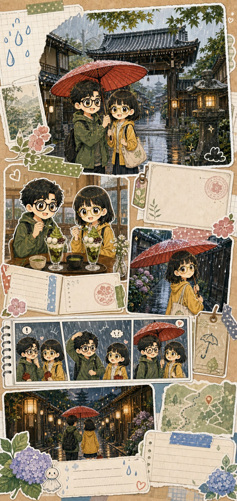
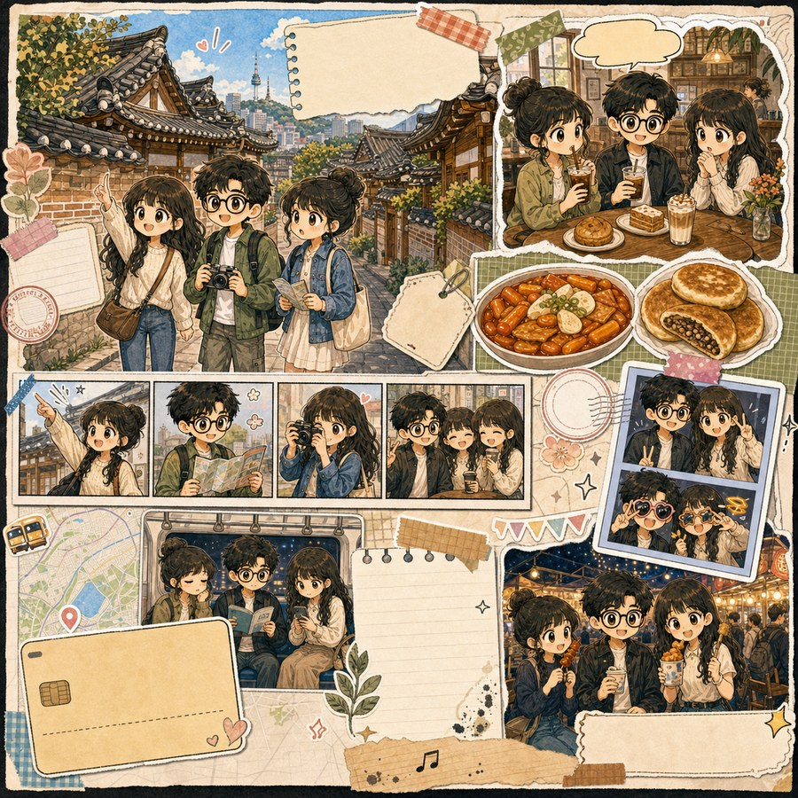
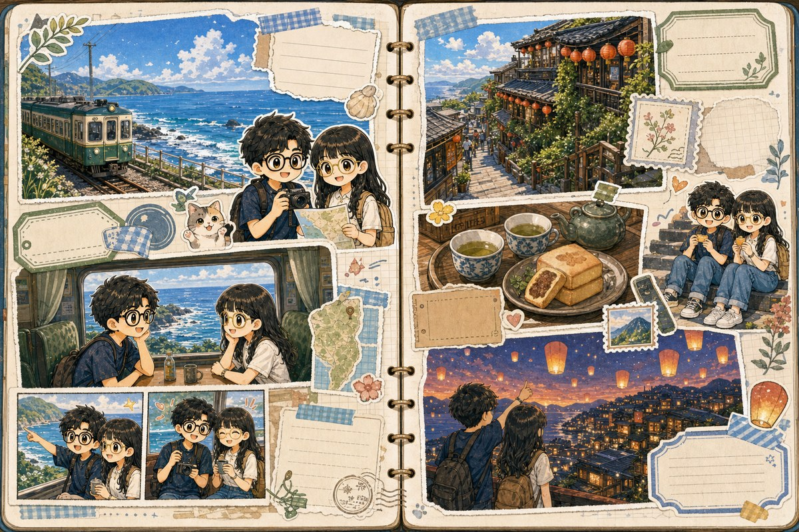

# Sticker Travel Scrapbook Skill

[English](README.md) | [简体中文](README.zh-CN.md) | [日本語](README.ja.md)

`sticker-travel-scrapbook` is a Codex Skill for creating, planning, revising, and interactively editing multi-style travel scrapbook pages, visual travel journals, and mini-comic travel diaries.

It is built for memory-first visual authoring: personal scenes, moods, companions, meals, objects, ticket-like scraps, photo slots, stickers, maps, polaroids, watercolor pages, vintage ephemera, urban sketches, black-and-white doodles, and small comic moments. It is not a route-first itinerary board or a clean travel photo book.

By default, it is an agent-led workflow rather than only a prompt generator. A user can send a completed trip plan, photos, notes, and rough preferences; Codex should parse the materials, ask only the key missing questions, draft the page/components/object manifest, and then help generate the final scrapbook image, export prompts, or open the GUI for manual control.

## Example Gallery

These are public-safe generated examples. They do not use private travel photos, commercial characters, brand mascots, real tickets, or private people.

Format and size range, using one cute sticker comic route:

<table>
  <tr>
    <td width="44%" rowspan="2" valign="top">
      <strong>Long phone page: Kyoto rainy temple street</strong><br>
      
    </td>
    <td width="56%" valign="top">
      <strong>Single page: Seoul hanok village and night market</strong><br>
      
    </td>
  </tr>
  <tr>
    <td width="56%" valign="top">
      <strong>Two-page spread: Taiwan coastal train and lantern old street</strong><br>
      
    </td>
  </tr>
</table>

Visual route examples:

<table>
  <tr>
    <td width="44%" rowspan="2" valign="top">
      <strong>Black-and-white cartoon doodle</strong><br>
      
    </td>
    <td width="56%" valign="top">
      <strong>Map-based information scrapbook</strong><br>
      
    </td>
  </tr>
  <tr>
    <td width="56%" valign="top">
      <strong>Polaroid photo collage</strong><br>
      
    </td>
  </tr>
</table>

## What The Skill Does

- Guides non-expert users from messy travel materials to a concrete scrapbook plan.
- Structures travel materials into scrapbook-ready memory scenes.
- Asks focused follow-up questions only when style, character, layout, text, or generation intent is unclear.
- Plans multi-style scrapbook, visual journal, and mini-comic pages.
- Chooses among visual routes such as East Asian sticker comic, kawaii sticker journal, black-and-white cartoon doodle, map infographic, polaroid photo collage, watercolor travel journal, vintage ephemera scrapbook, urban sketch journal, minimalist line journal, comic book travel page, and mixed-media collage.
- Creates editable object manifests with stable IDs such as `P1-IMG1`, `P1-TXT1`, `P1-CHR1`, `P1-STK1`, and `P1-PNL1`.
- Drafts components such as character stickers, photo slots, scene panels, text cards, map/ticket scraps, and decorative stickers before final page generation when the user wants staged control.
- Maintains character and style consistency across pages.
- Generates copyable image prompts, component prompts, or final images when an image-generation tool/API is available and requested.
- Supports localized revision prompts, such as replacing one image slot without redesigning the full page.
- Includes a local web GUI as a manual-control mode for project editing, prompt building, JSON import/export, and optional API-backed image generation.

## Repository Layout

```text
Sticker-Travel-Scrapbook/
  SKILL.md
  README.md
  README.zh-CN.md
  README.ja.md
  agents/
    openai.yaml
  scripts/
    server.py
  assets/
    brand/
      banner.jpg
    examples/
      black-white-doodle-rainy-temple.jpg
      kyoto-rainy-temple.jpg
      map-infographic-coastal-train.jpg
      polaroid-weekend-notes.jpg
      seoul-hanok-market.jpg
      taiwan-coastal-train.jpg
    gui/
      index.html
      blank-project.json
      demo-project.json
  references/
    authoring-workflow.md
    memory-structure.md
    scrapbook-visual-routes.md
    comic-panel-patterns.md
    character-consistency.md
    editable-object-manifest.md
    prompt-template.md
    revision-protocol.md
    qa-checklist.md
    gui-workflow.md
    public-asset-policy.md
    default-config.yaml
    character-profile.example.yaml
```

## Installation

Copy this repository folder into a Codex skills directory and keep the folder name as `sticker-travel-scrapbook`.

On Windows, a user-level location is typically:

```powershell
C:\Users\<you>\.codex\skills\sticker-travel-scrapbook
```

If Codex does not detect the Skill immediately, restart Codex or start a new thread.

## Basic Usage In Codex

Explicitly invoke the Skill. For a beginner-friendly flow, you can simply give the trip materials and let Codex guide the missing decisions:

```text
Use $sticker-travel-scrapbook.
I want to create a travel scrapbook / visual journal / mini-comic page, but I am not sure about the exact style and layout yet.

Trip content:
June 19, city park night visit, summer festival. Key memories include night lights, a small parade, a roller coaster, snacks, fireworks, and walking back through a lively crowd. The mood is excited, warm, and celebratory.

Please output:
1. A structured travel-memory table
2. Any key missing questions or default assumptions
3. Page format and layout suggestions
4. An editable object manifest and component draft using IDs such as P1-IMG1 / P1-TXT1 / P1-CHR1 / P1-PNL1
5. Visual route, character/persona settings, and exact text list
6. Component prompts or a final image-generation prompt
7. Ask me whether to generate the final scrapbook image, generate components first, export the prompt pack, or open the GUI
```

If the style, layout, text, characters, and generation target are already clear, Codex should proceed directly instead of adding unnecessary questions.

Revision example:

```text
Use $sticker-travel-scrapbook.
I like the whole scrapbook page. Only replace P3-IMG2 with my uploaded real photo.
Keep the people, title, museum cards, captions, and overall layout unchanged.
Give me only a localized revision prompt.
```

## Local GUI

The Skill includes a lightweight local GUI for full manual control. It starts from a blank project by default.

Launch it with:

```powershell
python "C:\Users\<you>\.codex\skills\sticker-travel-scrapbook\scripts\server.py" --project ".\sticker-travel-scrapbook-project.json"
```

Then open the printed local URL, usually:

```text
http://127.0.0.1:8765/
```

The GUI supports travel-brief editing, style-bible editing, material notes, page and object creation, editable object IDs, current-page image prompt generation, project JSON import/export, and a generated-image gallery when API generation is enabled. Use it when you want direct control over the objects and generation settings instead of an agent-led dialogue.

## Optional GUI Image Generation

The GUI can call the OpenAI Images API if `OPENAI_API_KEY` is set in the server environment before launch:

```powershell
$env:OPENAI_API_KEY="sk-..."
python "C:\Users\<you>\.codex\skills\sticker-travel-scrapbook\scripts\server.py" --project ".\sticker-travel-scrapbook-project.json"
```

## Validation

Validate the Skill with the built-in skill creator validator:

```powershell
$env:PYTHONUTF8='1'
python "C:\Users\<you>\.codex\skills\.system\skill-creator\scripts\quick_validate.py" "C:\Users\<you>\.codex\skills\sticker-travel-scrapbook"
```

Expected output:

```text
Skill is valid!
```

## Current Boundary

This is a Skill plus local GUI prototype. The default Skill behavior is an agent-led scrapbook authoring workflow; prompt packs and the GUI are two control surfaces inside that workflow. Direct image generation depends on the image tools or API keys available in the user's Codex/runtime environment.

